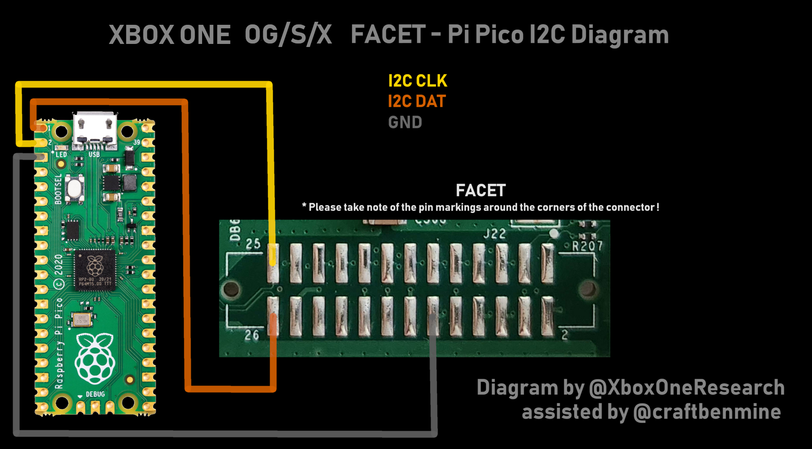
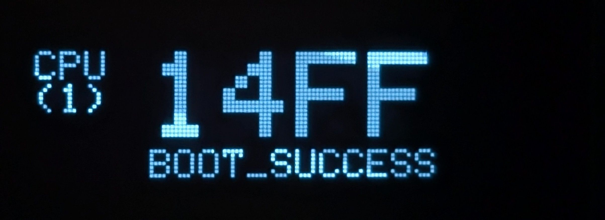

# Durango POST-Code reader via RasPi Pico

This software for the Raspberry Pi Pico serves two purposes.

- On Startup, it does a I2C bus scan, to enumerate available devices (f.e. Voltage control ICs)
- After that, it goes into I2C Slave Mode and poses as MAX6958A (7-Segment-Display-IC). This allows to listen for POST codes.

Technical infos:

- [POST bus on Xbox One](https://xboxoneresearch.github.io/wiki/hardware/post/)

Interpretation of the values? That's not figured out yet lol

## Connections

> [!IMPORTANT]
> With version v0.1.3, pin assignments for I2C got changed to GP0/GP1, to be in-sync with the pins used by [DuRFUnitI2C](https://github.com/xboxoneresearch/DuRFUnitI2C).
> Before that I2C was on GP4/GP5.

Pi Pico -> FACET

- SDA: Pi Pico Pin 0 (GP0) -> FACET Pin 26
- SCL: Pi Pico Pin 1 (GP1) -> FACET Pin 25
- GND -> GND

### Optional: 0.91" OLED Display (SSD1306)

- Pi Pico 3V3 -> Display VCC
- SDA: Pi Pico Pin  9 (GP6) -> Display Pin SDA
- SCL: Pi Pico Pin 10 (GP7) -> Display Pin SCL
- GND -> GND

## Usage

- Download [latest release](https://github.com/xboxoneresearch/PicoDurangoPOST/releases/latest)
- Flash/Copy *.uf2 onto Pi Pico
- Listen on the exposed USB Serial interface (via PuTTy or similar UART monitor software)

## Develop

- VS Code
- Extension: PlatformIO
- Upload and Monitor
